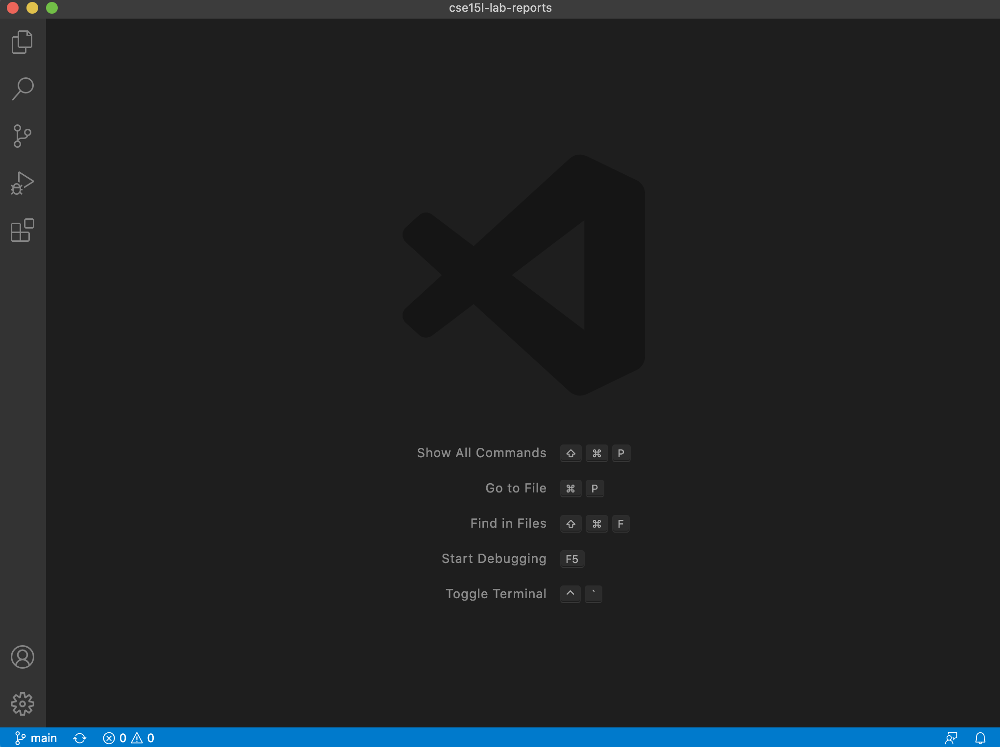
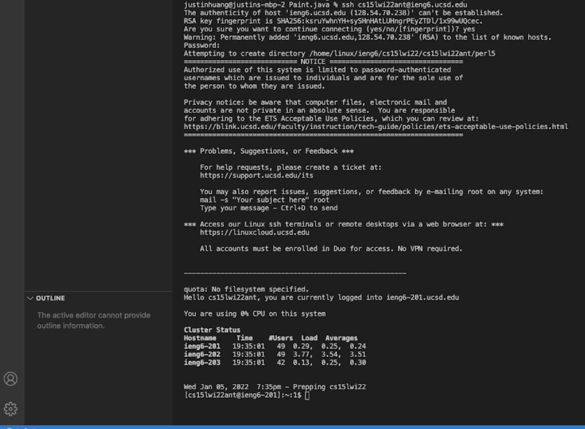
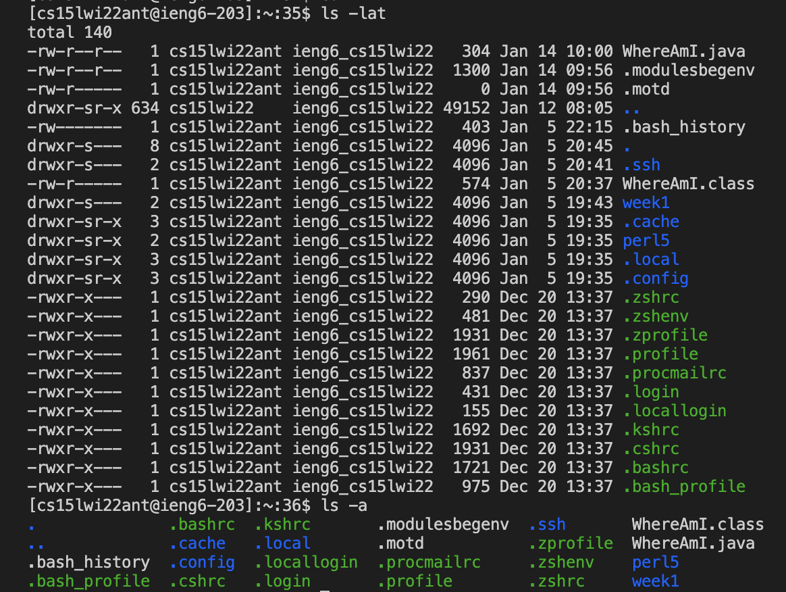
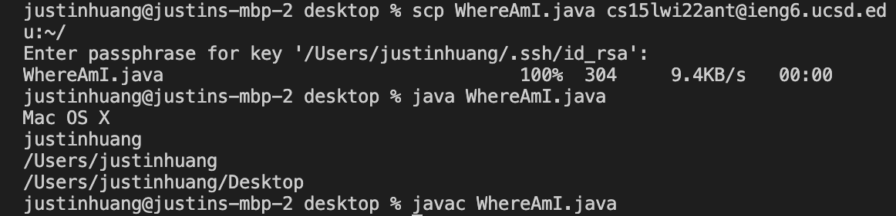
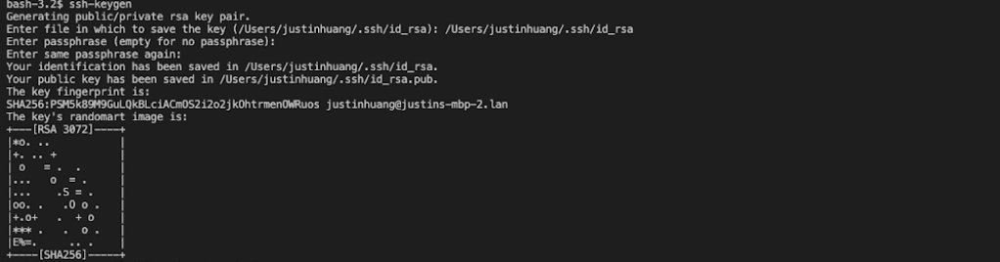
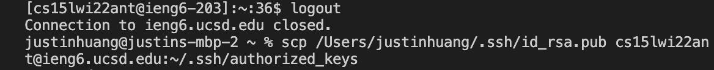
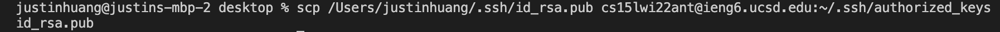
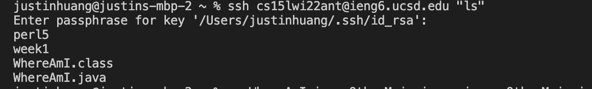
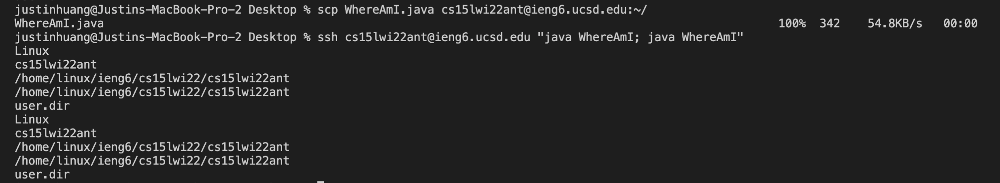

## Lab report week 1
# 1.Installing VScode

To install VScode, first go to the [VS code Website](https://code.visualstudio.com),  and download the version on either Mac or Windows. Once that finishes, load up the file, and it should look something like this.
 


# 2.Remotely Connecting

If on Windows, install a program by the name of OpenSSH, no programs need to be installed on Mac. Then, open the terminal in VS code by clicking on Terminal -> new terminal in the menu button. Type in the command prompt:  `ssh cs15lwi22ant@ieng6.ucsd.edu`



# 3.Trying Some Commands

There are many commands to use in the terminal. Some examples are pwd, which means print working directory, cd, which means current directory, ls -a meaning show files, and scp meaning secure files. Here are some outputs of some commands.



# 4.Moving Files with scp

To move files with SCP, use the command: scp WhereAmI.java ```cs15lwi22ant@ieng6.ucsd.edu:~/```. After entering in your password, it should look something like this:


 
# 5.Setting an SSH Key

In order to bypass entering the computer’s password everytime when using scp, ```SSH-keygen``` is a great way to get past this. The command for setting up an SSH key is 	```ssh-keygen```. After that is set up, logout of session, and run client locally with command should look something like this:







My passphrase is not empty, which is why it prompts for passphrase in future steps.

# 6.Optimizing Remote Running

To run commands remotely, use the command `ssh cs15lwi22@ieng6.ucsd.edu "ls`. It is also useful to use a semicolon so that multiple files can be run at once, such as cp WhereAmI.java ; java WhereAmI. Arrow keys can also be used to access previous commands to avoid typing it all over again.



For me to meet the challenge of saving and running the java code remotely, I copied and pasted the scp command from step 4. This took 3 keystrokes. One to highlight the text, one to copy, and one to paste. To run the command remotely, I used the up arrow to access the previous ssh comand from before. I copy and pasted the ```; java WhereAm I``` from the cse 15L website. This took 6 steps. Three keystrokes to access a previous command, and three keystrokes to copy and paste.




[Home](index.md)
