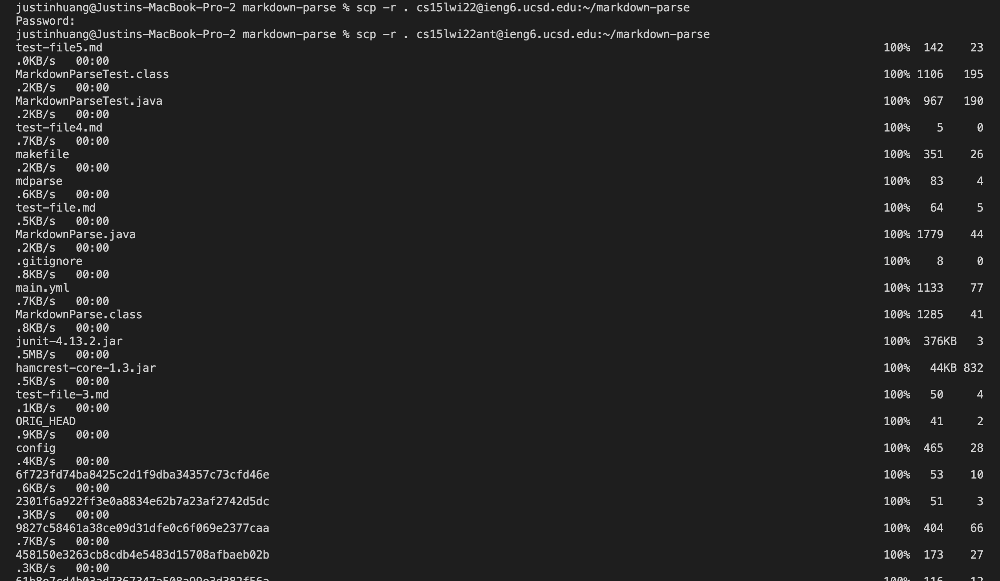
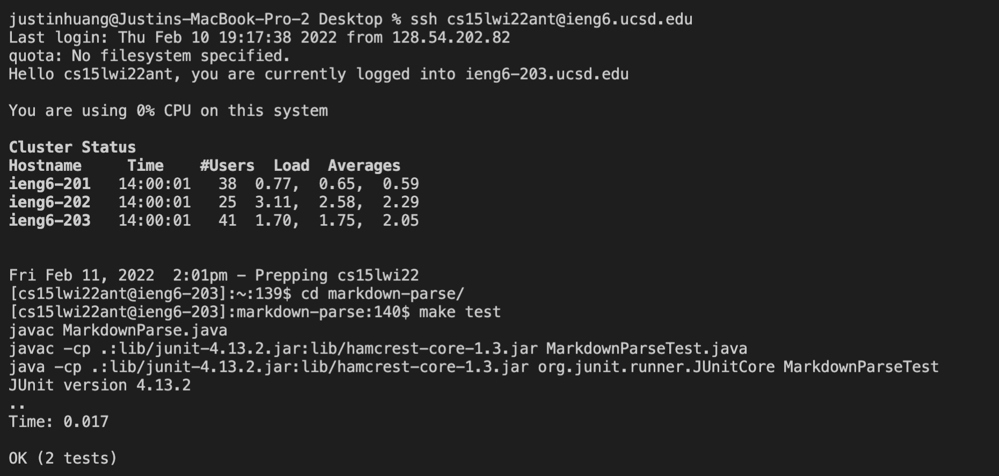
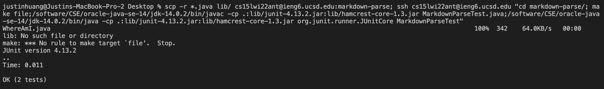

# Copy Whole Directories With SCP (Choice 3)

### Copying whole markdown parse directory

 To copy the whole repository over, I used the command `cp -r . cs15lwi22@ieng6.ucsd.edu:~/markdown-parse`. But for future steps where I am required to do this again, I used the command `scp -r *.java *.md lib/ cs15lwi22@ieng6.ucsd.edu:markdown-parse` so that it only copies the essential files over to the directory.

### Logging into scp and running tests

To run the commands remotely, I first login to the server with the command `ssh cs15lwi22ant@ieng6.ucsd.edu`. To run the tests remotely, I first switched to the markdown parse in order to access the test file and markdown parse file. To do so, I used the command `cd markdown-parse/` to switch directories. The last step where I ran the files is using `make test`. In the make test file as covered in class, it contains all the essential commands to run the Junit tests.

### Running tests in one line

To run it remotely, I combined all the commands into one line. The resulting command is :`scp -r *.java lib/ cs15lwi22ant@ieng6.ucsd.edu:markdown-parse; ssh cs15lwi22ant@ieng6.ucsd.edu "cd markdown-parse/; /software/CSE/oracle-java-se-14/jdk-14.0.2/bin/javac -cp .:lib/junit-4.13.2.jar:lib/hamcrest-core-1.3.jar MarkdownParseTest.java;/software/CSE/oracle-java-se-14/jdk-14.0.2/bin/java -cp .:lib/junit-4.13.2.jar:lib/hamcrest-core-1.3.jar org.junit.runner.JUnitCore MarkdownParseTest"`. The first part includes copying the directory over with `scp`, second part is remote running, where I changed to the markdown parse directory. Third and fourth part is where I added commands to run the tests remotely. Each part of the total command is seperated by the semicolon. 

