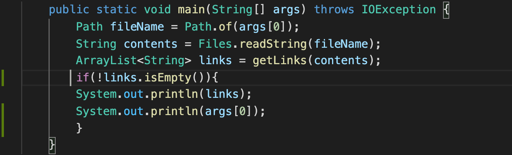
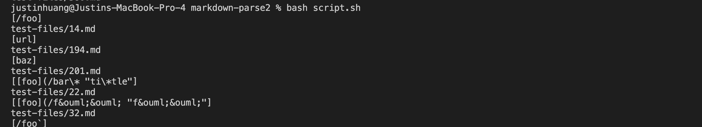
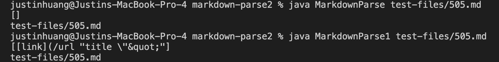
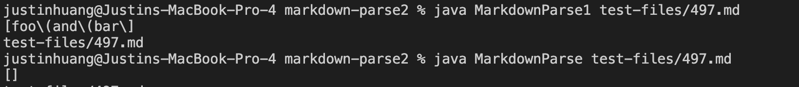

# Lab 5

## Finding different outputs

To find the different outputs for the file, I edited each of the print statements in each markdown parse implementation to something like this: 

This will only print the file output and file name if and only if the file is non empty. The results look something like this:


After getting the results for both implementations, I added both of the results to the google docs and compared side by side. It was not exactly an even comparison, as my comparison printed out results when they were supposed to be empty. However, I was able to make it work by looking for extremely strange outputs and identifying what caused that for the lab report.

Google Docs [link](https://docs.google.com/spreadsheets/d/1esdOzHaPRJhf90w0g5tPlEBzoS7O3a7hU6zmWr8CfkM/edit?usp=sharing)

## First Different File Implementation

The first difference where I found between my implementation and the professor's implementation is in [505.md](https://github.com/ucsd-cse15l-w22/markdown-parse/blob/main/test-files/505.md). The professor's output value is `[]`, because the text file is not a valid link. But, my test implementation printed out `[[link](/url "title \"&quot;"]`. The reason why it is not a link is because it contains spaces, quotes at various places of the file, as well as backslashes throughout the link. The file has the text `[link](/url "title \"&quot;")`. 

Output for both implementations can be seen here:


The reason why the professor's implementation printed out the proper link is because it had the test scenario of `[link](/url "title \"&quot;")` meaning that it only prints out the link if it has no spaces. My implementation did not contain this scenario, and thus it printed out the link.

## Second Differemt File Implementation

The second different output is in file (497.md)[https://github.com/ucsd-cse15l-w22/markdown-parse/blob/main/test-files/497.md], where it has the text `[link](foo\(and\(bar\))`. This is obviously not a valid link due to the number of open and closed parenthesis in the markdown parse. Naturally, the expected output should be empty as it is not a real link and should not be returned. 

The implementation done by the professor is correct, while mine is wrong.



The reason why the professor's implementation passed and mine did not is because I did not have the method where there must be an equal number of open and closed parenthesis in the file. The java implementation given by the professor contains the method findCloseParen which will return a negative number if it cannot find a corresponding close parenthesis for every open parenthesis. 

Code from professor:
``` 
static int findCloseParen(String markdown, int openParen) {
        int closeParen = openParen + 1;
        int openParenCount = 1;
        while (openParenCount > 0 && closeParen < markdown.length()) {
            if (markdown.charAt(closeParen) == '(') {
                openParenCount++;
            } else if (markdown.charAt(closeParen) == ')') {
                openParenCount--;
            }
            closeParen++;
        }
        if(openParenCount == 0) {
          return closeParen - 1;
        }
        else {
          return -1;
        }

    } 
```
Since my implementation only contain the code which will return empty if it does not contain parenthesis, it did not return the correct expected answer.

My code in regards to parenthesis:
```
 int openParen = markdown.indexOf("(", nextCloseBracket);
            int closeParen = markdown.indexOf(")", openParen);
            if(openParen == -1 || closeParen == -1){
                return toReturn;
            }
```


