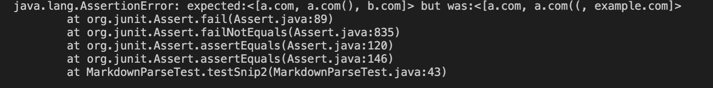

# Week 4 lab report

## Snippet 1
The proper output for the first snippet should be : [google.com`, [google.com](google.com), [ucsd.edu](ucsd.edu)]

Test:

My implementation did not pass the test for snip 1.
Output:

## Snippet 2
The proper output for the second snippet should be: [a.com, a.com(), b.com]

Test:

My implementation did not pass the test for snip 2.
Output:

## Snippet 3
The proper output for the third snippet should be: [[https://www.twitter.com](https://www.twitter.com), [https://ucsd-cse15l-w22.github.io/](https://ucsd-cse15l-w22.github.io/), [https://cse.ucsd.edu/](https://cse.ucsd.edu/)]

Test:

My implementation did not pass the test for snip 3.

## Additional questions

### Backticks for snip 1
There is a short way to fix the backticks. The key would be to have a conditional statement that finds two backs either before the opening brackets or before the closing parenthesis.

### Extra parenthesis or brackets for snip 2
There may not be a short way to fix this issue, as it's difficult to keep track of all of the open and close brackets.The code in markdown parse will return a link as soon as it finds a pair of open and close parenthesis, even if the link has not been fully read. This is a difficult task because a lot thought and perhaps code needs to go into on determining whatever the getLinks has reached the end of the link given parenthesis.

### Multiple new lines for snip 3
This seems to be complicated, as one has to determine how to get the reader to read an input of multiple lines. There may be an easy way, but I do not recall in experience of coding to come up with such a way. The difficulty from this is that the reader only reads to the end of the line, getting it to continue reading until the it reaches a closed bracket is complicated since on eneeds to know various scenarios of text through different lines.